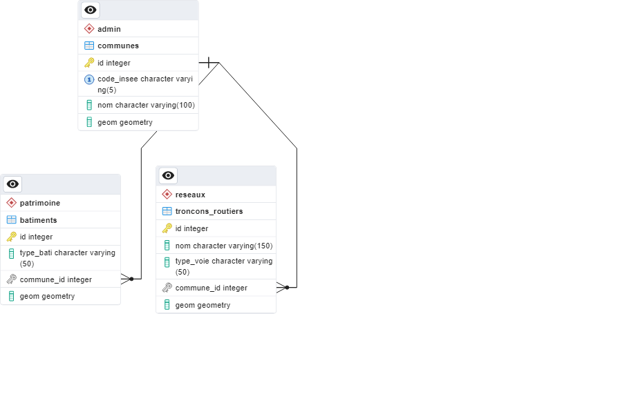

# Géo-Portfolio — Base de données spatiale PostgreSQL/PostGIS

Base de données géospatiale multi-couches (limites administratives, réseau routier, bâti,
casernes de pompiers) construite sur le département du Loiret (45), à partir de sources
officielles et communautaires croisées : IGN ADMIN EXPRESS COG et OpenStreetMap (extrait Geofabrik).

## Schéma entité-relation



## Modèle de données

- `admin.communes` — limites communales du Loiret (325 communes), source IGN ADMIN EXPRESS COG
- `reseaux.troncons_routiers` — réseau routier, source OpenStreetMap (Geofabrik)
- `patrimoine.batiments` — bâti, source OpenStreetMap (Geofabrik)
- `secours.casernes_pompiers` — casernes de pompiers, source OpenStreetMap (Geofabrik)
- `analyses.stats_par_commune` — vue matérialisée agrégeant km de routes, nombre de
  bâtiments et surface par commune
- `analyses.distance_caserne_par_commune` — vue matérialisée calculant la distance de
  chaque commune à la caserne de pompiers la plus proche
- `reseaux.reseau_noeud` — réseau routier topologiquement corrigé, utilisé pour le routage (pgRouting)
- `analyses.zones_isochrones` — vue matérialisée des zones d'accessibilité par caserne (0-15/15-30/30-45/45-60 min)

Chaque tronçon routier, bâtiment et caserne est rattaché à sa commune via une clé
étrangère `commune_id`, peuplée par jointure spatiale (`ST_Within` sur le centroïde
ou le point) après import — cette relation n'existe pas nativement dans les données sources.

## Cas d'usage : couverture territoriale des secours

En croisant les données de communes avec les positions des casernes de pompiers
(OpenStreetMap), la base identifie les communes du Loiret les plus éloignées d'une
caserne — un indicateur pertinent pour l'analyse de la couverture opérationnelle
des secours, à l'image des missions confiées aux géomaticiens de SDIS.

```sql
SELECT nom, distance_km_caserne_proche
FROM analyses.distance_caserne_par_commune
ORDER BY distance_km_caserne_proche DESC
LIMIT 15;
```

Cette analyse repose sur une nouvelle table `secours.casernes_pompiers`, rattachée
aux communes selon la même logique de jointure spatiale que les routes et le bâti.

## Points techniques

- Système de coordonnées : Lambert-93 (EPSG:2154)
- Contraintes de validité géométrique (`ST_IsValid`) sur toutes les tables
- Index spatiaux GIST sur toutes les colonnes géométriques
- Rôles séparés lecture (`sig_lecture`) / édition (`sig_edition`)
- Pipeline d'import entièrement automatisé et reproductible (voir `scripts/`)

## Montée en gamme : isochrones réelles avec pgRouting

L'analyse de distance à vol d'oiseau ci-dessus a été complétée par un calcul de **temps de
trajet réel sur le réseau routier**, via l'extension pgRouting. Cette évolution a nécessité
un travail de fond sur la qualité topologique du réseau OSM importé.

### Le problème rencontré : un réseau non connecté

Le réseau routier importé depuis OpenStreetMap présentait un défaut fréquent avec ce type
de données : les croisements de routes (carrefours) ne partagent pas toujours un point
géométrique commun, même quand ils se superposent visuellement. Un premier diagnostic avec
`pgr_analyzeGraph` a révélé que 231 267 intersections de ce type empêchaient toute analyse
de routage (71 % des nœuds du graphe étaient perçus comme des impasses).

### La correction

Le réseau a été « noeudé » via `ST_Union` + `ST_Dump`, qui force la découpe géométrique de
chaque ligne à chaque point de croisement réel. Après reconstruction de la topologie :
- Intersections non résolues : passées de 231 267 à **0**
- Segments isolés : passés de 127 225 à **1 034**
- Dead ends : ramenés à environ 20 % du réseau, cohérent avec les vraies impasses et les
  limites de la zone d'étude

### Le calcul d'isochrones

Chaque tronçon routable (14 catégories motorisées, de l'autoroute à la voirie de service)
s'est vu attribuer une vitesse de référence par type de voie, convertie en coût-temps.
`pgr_drivingDistance` calcule ensuite, depuis chaque caserne de pompiers, l'ensemble des
zones accessibles en 15, 30, 45 et 60 minutes - une mesure bien plus réaliste qu'une simple
distance géométrique, puisqu'elle respecte le tracé effectif des routes.

```sql
SELECT d.nom, d.distance_km_caserne_proche, t.temps_min_caserne
FROM analyses.distance_caserne_par_commune d
JOIN analyses.temps_caserne_par_commune t ON t.code_insee = d.code_insee
ORDER BY t.temps_min_caserne DESC
LIMIT 15;
```

### Limites assumées de cette modélisation

- Vitesses de référence par type de voie (pas de données de trafic réel)
- Réseau considéré bidirectionnel (sens uniques non pris en compte)
- Zones dessinées par enveloppe convexe (`ST_ConvexHull`), qui simplifie la forme réelle
  de la zone accessible ; une enveloppe concave (`ST_ConcaveHull`) serait plus fidèle
  mais plus coûteuse à calculer

## Reproduire ce projet

1. Créer une base PostgreSQL avec l'extension PostGIS activée
2. Télécharger les données sources :
   - [IGN ADMIN EXPRESS COG](https://cartes.gouv.fr) (format GeoPackage ou Shapefile)
   - [Geofabrik – Centre-Val de Loire](https://download.geofabrik.de/europe/france/centre-val-de-loire.html)
3. Adapter les chemins dans `scripts/import_pipeline.ps1`
4. Exécuter : `powershell -ExecutionPolicy Bypass -File scripts/import_pipeline.ps1`

## Exemple de requête d'analyse

```sql
SELECT nom, km_routes, nb_batiments, surface_km2
FROM analyses.stats_par_commune
ORDER BY nb_batiments DESC
LIMIT 10;
```

## Auteur

**Alain Georges Tiossep Tsepeng**
[LinkedIn](https://www.linkedin.com/in/alain-georges-tiossep-tsepeng-1129b416b/)